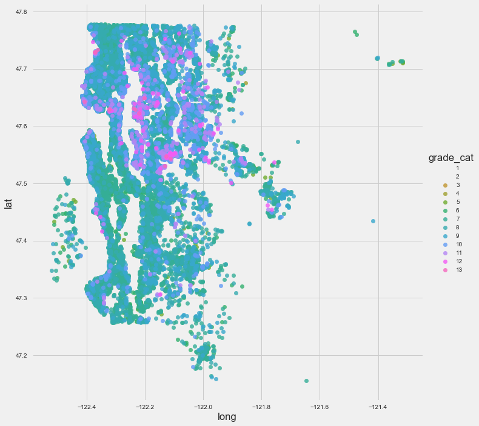

# Home Value Prediction with a Multiple Linear Regression Algorithm


This datascience project demonstrates how to use `multiple linear regression with OLS` to `select the least number of features most important for predicting the price of a home in King County, Washington`.



## Prerequisites

Before you begin, ensure you have met the following requirements:

* You have installed the latest version of `Jupyter Notebook`
* You have a `<Windows/Linux/Mac>` machine.

### FSDS - standard data science tools

You can do a quick install of all the standard data science libraries (matplotlib, pandas, etc) using the FSDS pypi package from `James Irving`:

```bash
pip install -U fsds_100719
```

### ZIP_STATS()

To utilize the `zip_stats()` median home value by zipcode lookup function, you'll need to install the USZIPCODE pypi package. This can easily be done either in the command line or in your Jupyter Notebook using `pip` package manager. The code for this function can be found in the `functions.py` file inside this repository as well as at the bottom of this README.

```bash
pip install USZIPCODE

```

### Libraries used in this project

```python

import fsds_100719 as fs
from fsds_100719.imports import *
plt.style.use('seaborn-bright')
import statsmodels.api as sm
import statsmodels.stats.api as sms
import statsmodels.formula.api as smf
import scipy.stats as stats
from scipy.stats import normaltest as normtest # D'Agostino and Pearson's omnibus test
from collections import Counter
from sklearn.preprocessing import RobustScaler

```

## Running the Project

To run this project locally, follow these steps:

In the command line/terminal:

```bash
git clone https://github.com/hakkeray/home-value-prediction-with-multiple-linear-regression-algorithm
cd home-value-prediction-with-multiple-linear-regression-algorithm
jupyter notebook
```

## Business Case

Identify best combination of variable(s) for predicting property values in King County, Washington.

## OBJECTIVES

1. Address null, missing, duplicate, and unreliable values in the data.
2. Determine best approach for analyzing each feature: continuous vs. categorical values
3. Identify which combination of features (X) are the best predictors of the target (y). 

## Process Outline

### Scrub

How should we address each feature to prepare it for EDA?

### Explore

-Which predictors are closely related (and should be dropped)?
-Is there an overlap in square-footage measurements?
-Can we combine two features into one to achieve a higher correlation?
-Does geography (location) have any relationship with the values of each categorical variable?

### Model

-Which features are the best candidates for predicting property values?
-Does removing outliers improve the distribution?
-Does scaling/transforming variables improve the regression algorithm?

---

## TABLE OF CONTENTS

### 1 - OBTAIN

Import libraries, packages, data set

-1.1 Import libraries and packages
-1.2 Import custom functions
-1.3 Import dataset and review columns, variables

### 2 - SCRUB

Clean and organize the data.

-2.1 Find and replace missing values (nulls)
-2.2 Identify/Address characteristics of each variable (numeric vs categorical) 
-2.3 Check for and drop any duplicate observations (rows)
-2.4 Decide which variables to keep for EDA

### 3 - EXPLORE

Preliminary analysis and visualizations.

-3.1 Linearity: Scatterplots, scattermatrix
-3.2 Multicollinearity: Heatmaps, scatterplots
-3.3 Distribution: Histograms, Kernel Density Estimates (KDE), LMplots, Boxplots
-3.4 Regression: regression plots

### 4 - MODEL

Iterate through linreg models to find best fit predictors

-4.1 Model 1: OLS Linear Regression
-4.2 Model 2: One-Hot Encoding
-4.3 Model 3: Error terms
-4.4 Model 4: QQ Plots
-4.5 Model 5: Outliers
-4.6 Model 6: Robust Scaler

### 5 - VALIDATION

Validate the results.

-5.1 K-Fold Cross Validation

### 6 - INTERPRET

Summarize the findings and make recommendations.

-6.1 Briefly summarize the results of analysis
-6.2 Make recommendations
-6.3 Describe possible future directions

### 7 - Additional Research

Extracting median home values based on zipcodes

## Interactive Map on Tableau

Interactively view median home values by zip code boundaries on Tableau:
[Tableau Interactive Map](https://public.tableau.com/views/HousePricesbyZipCodeinKingCountyWA/KingCounty?:display_count=y&:origin=viz_share_link)

## Conclusion

We can be confident that 78% of the final model (#6) explains the variation in data. Unfortunately, multicollinearity is a significant issue for linear regression and cannot be completely avoided.

## Recommendations

According to our final model, the best predictors of house prices are sqft-living, zipcode, and grade.

1. Homes with larger living areas are valued higher than smaller homes.
2. Houses in certain zip codes are valued at higher prices than other zip codes.
3. Homes that score above at least 8 on Grade will sell higher than those below.

## Future Work

### 1. Identify ranking for zip codes by highest home prices (median home value)

### 2. Do house prices change over time or depending on season

This data set was limited to a one-year time-frame. I'd be interested in widening the sample size to investigate how property values fluctuate over time as well as how they are affected by market fluctuations.

### 3. Resold Houses (duplicate IDs)

Can we further validate (or improve) the model's accuracy by looking specifically at houses that resold for a higher price in a given timeframe?** In other words, try to identify which specific variables changed (e.g. increased grade score after doing renovations) and therefore were determining factors in the increased price of the home when it was resold.

## Zip Codes and Median Home Values Lookup Function

```python
# --------- ZIP_STATS() --------- #

def zip_stats(zipcodes, minimum=0, maximum=5000000, simple=True):
    """
    Lookup median home values for zipcodes or return zip codes of a min and max median home value
    #TODO: add input options for city state county
    #TODO: add input options for other keywords besides median home val
    *Prerequisites: USZIPCODE() pypi package is a required dependency
    **ARGS
    zipcodes: dataframe or array of strings (zipcodes)
    > Example1: zipcodes=df[zipcode']
    > Example2: zipcodes=['01267','90025']
    minimum: integer for dollar amount min threshold (default is 0)
    maximum: integer for dollar amount max threshold (default is 5000000, i.e. no maximum)
    **KWARGS
    simple: default=True
    > set simple_zipcode=False to use rich info database (will only apply once TODOs above are added)
    """
    # pypi package for retrieving information based on us zipcodes
    import uszipcode
    from uszipcode import SearchEngine
    # set simple_zipcode=False to use rich info database
    if simple:
        search = SearchEngine(simple_zipcode=True)
    else:
        search = SearchEngine(simple_zipcode=False)
    # create empty dictionary
    dzip = {}
    # search pypi uszipcode library to retrieve data for each zipcode
    for code in zipcodes:
        z = search.by_zipcode(code)
        dzip[code] = z.to_dict()
    keyword='median_home_value'
    # # pull just the median home values from dataset and append to list
    # create empty lists for keys and vals
    keys = []
    zips = []
    for index in dzip:
        keys.append(dzip[index][keyword])
    # put zipcodes in other list
    for index in dzip:
        zips.append(dzip[index]['zipcode'])
    # zip both lists into dictionary
    zipkey = dict(zip(zips, keys))
    zipvals = {}
    for k,v in zipkey.items():
        if v > minimum and v < maximum:
            zipvals[k]=v
    return zipvals
```

### Examples

Lookup median home value for a list of zipcodes
_(01267 is Williamstown MA and 90025 is Los Angeles, CA)_

```python

zip_stats(zipcodes=['01267','90025'])

```

* {'01267': 293000, '90025': 669100}

Lookup zipcodes in king county dataset with at least $800,000 median value

```python

zip_stats(zipcodes=df.zipcode.unique(), minimum=800000)

```

* {'98040': 864000, '98039': 1000001}

```python

# HOT_STATS() function: display statistical summaries of a feature column
def hot_stats(data, column, verbose=False, t=None):
    """
    Scans the values of a column within a dataframe and displays its datatype, nulls (incl. pct of total), unique values, non-null value counts, and statistical info (if the datatype is numeric).
    ---------------------------------------------
    Parameters:
    **args:
        data: accepts dataframe
        column: accepts name of column within dataframe (should be inside quotes '')
    **kwargs:
        verbose: (optional) accepts a boolean (default=False); verbose=True will display all unique values found.
        t: (optional) accepts column name as target to calculate correlation coefficient against using pandas data.corr() function.
    -------------
    Examples:
    hot_stats(df, 'str_column') --> where df = data, 'string_column' = column you want to scan
    hot_stats(df, 'numeric_column', t='target') --> where 'target' = column to check correlation value
    -----------------
    Developer notes: additional features to add in the future:
    -get mode(s)
    -functionality for string objects
    -pass multiple columns at once and display all
    -----------------
    """
    # assigns variables to call later as shortcuts 
    feature = data[column]
    rdash = "-------->"
    ldash = "<--------"
    # figure out which hot_stats to display based on dtype 
    if feature.dtype == 'float':
        hot_stats = feature.describe().round(2)
    elif feature.dtype == 'int':
        hot_stats = feature.describe()
    elif feature.dtype == 'object' or 'category' or 'datetime64[ns]':
        hot_stats = feature.agg(['min','median','max'])
        t = None # ignores corr check for non-numeric dtypes by resetting t
    else:
        hot_stats = None

    # display statistics (returns different info depending on datatype)
    print(rdash)
    print("HOT!STATS")
    print(ldash)
    # display column name formatted with underline
    print(f"\n{feature.name.upper()}")
    # display the data type
    print(f"Data Type: {feature.dtype}\n")
    # display the mode
    print(hot_stats,"\n")
    print(f"à-la-Mode: \n{feature.mode()}\n")
    # find nulls and display total count and percentage
    if feature.isna().sum() > 0:  
        print(f"Found\n{feature.isna().sum()} Nulls out of {len(feature)}({round(feature.isna().sum()/len(feature)*100,2)}%)\n")
    else:
        print("\nNo Nulls Found!\n")
    # display value counts (non-nulls)
    print(f"Non-Null Value Counts:\n{feature.value_counts()}\n")
    # display count of unique values
    print(f"# Unique Values: {len(feature.unique())}\n")
    # displays all unique values found if verbose set to true
    if verbose == True:
        print(f"Unique Values:\n {feature.unique()}\n")
    # display correlation coefficient with target for numeric columns:
    if t != None:
        corr = feature.corr(data[t]).round(4)
        print(f"Correlation with {t.upper()}: {corr}")
```

hot_stats() example output

```python

"""
-------->
HOT!STATS
<--------

CONDITION
Data Type: int64

count    21597.000000
mean         3.409825
std          0.650546
min          1.000000
25%          3.000000
50%          3.000000
75%          4.000000
max          5.000000
Name: condition, dtype: float64

à-la-Mode:
0    3
dtype: int64

No Nulls Found!

Non-Null Value Counts:
3    14020
4     5677
5     1701
2      170
1       29
Name: condition, dtype: int64

Unique Values: 5
"""
```

## Contact

If you want to contact me you can reach me at <rukeine@gmail.com>.

## License

This project uses the following license: [MIT License](./LICENSE.md).

```python
#         _ __ _   _
#  /\_/\ | '__| | | |
#  [===] | |  | |_| |
#   \./  |_|   \__,_|
```
